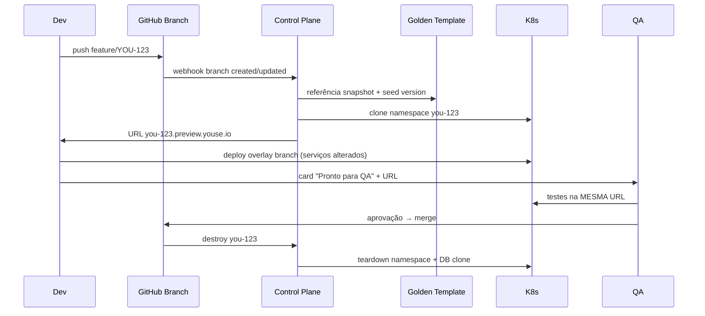

# Projeto Ambientes Youse — v2.0
## Estratégia de Ambientes por Clone (Golden Template)

**Organização:** Youse Seguradora  
**Versão:** 2.0 | **Data:** Junho/2026  
**Base:** [PROJETO-AMBIENTES-YOUSE.pdf](./PROJETO-AMBIENTES-YOUSE.pdf) v1.3  
**Status:** Em construção — validação com Time de Qualidade → Infra → liderança (futuro)

---

## 1. Resposta direta: isso é possível?

**Sim.** O modelo de ambientes efêmeros criados a partir de um **ambiente padrão (golden template)** com massa de dados já é prática consolidada em empresas com Kubernetes, IaC e pipelines maduros — e a Youse já possui a maior parte das peças:

| Peça existente na Youse | Papel no modelo clone |
|-------------------------|------------------------|
| EKS + namespaces (`gitops-kubernetes-addons`) | Isolamento por ambiente/branch |
| Helm (`.helm/qa.yaml`, `.helm/stage.yaml`) | Template de deploy por serviço |
| `deployment-orb` (CircleCI) | Orquestração create/destroy |
| Terraform + Route53 | DNS wildcard `*.preview.youse.io` |
| 461 repos, microserviços | Clone híbrido ou full-stack conforme escopo |
| `qa-e2e-tests-automation` (Playwright + GHA) | Gatilho YAML → ambiente → testes → destroy |

O que **não existe hoje** (e precisa ser construído):

1. **Ambiente Golden** versionado, com massa de dados conhecida e atualizada periodicamente  
2. **Mecanismo de clone** (infra + dados + config) automatizado e idempotente  
3. **Control plane** — serviço ou pipeline que recebe pedido de ambiente e executa ciclo de vida  
4. **Governança de custo/TTL** — destruição garantida após uso  
5. **Catálogo de serviços** — quais entram no clone full vs. híbrido  

---

## 2. Mudança de paradigma: v1.3 → v2.0

### v1.3 (documento anterior)
- Preview por branch com modelo **híbrido**: sobe só o que mudou; dependências apontam para Stage.
- Ambientes fixos (Automation, Perf, QA) como destinos permanentes.

### v2.0 (proposta clone)
- Todo ambiente efêmero nasce de um **clone do Golden Template** — não de um deploy vazio.
- Dev, QA, Produto e Automação usam o **mesmo mecanismo**; muda só a **origem do template** e o **TTL**.
- Automação de regressão **cria ambiente via YAML**, executa suite, **destrói sempre** (sucesso ou falha).

```
┌─────────────────────────────────────────────────────────────────┐
│                    GOLDEN TEMPLATES (fixos)                      │
├─────────────────┬─────────────────┬───────────────────────────────┤
│ golden-dev      │ golden-qa       │ golden-automation             │
│ (massa leve)    │ (massa UAT)     │ (massa E2E congelada)         │
│ refresh: diário │ refresh: diário │ refresh: pós-promote Stage    │
└────────┬────────┴────────┬────────┴──────────────┬──────────────┘
         │ CLONE           │ CLONE                 │ CLONE (YAML)
         ▼                 ▼                       ▼
   you-123.preview   you-456.preview         auto-run-789.preview
   (branch feature)  (branch feature)        (efêmero 2–4h)
         │                 │                       │
         └─ merge/close ──┴─ TTL 72h ────────────┴─ teardown always
```

---

## 3. Arquitetura alvo

### 3.1 Camadas

| Camada | Tipo | Descrição |
|--------|------|-----------|
| **Golden Templates** | Fixo | Ambientes “foto” com versões, toggles e dados conhecidos |
| **Ambientes por Clone** | Efêmero | Instâncias criadas a partir do template (branch, PR, automação) |
| **Ambientes de Release** | Fixo | Stage → Automation (regressão estável) → QA/UAT → Pre-Prod → Prod |
| **Ambientes Especializados** | Fixo | Perf/Chaos (`perf.youse.io`) — nunca efêmeros de branch |

### 3.2 Tipos de clone

| Tipo | Origem | Quem usa | TTL | URL exemplo |
|------|--------|----------|-----|-------------|
| **Preview Dev/QA** | `golden-dev` ou `golden-qa` | Dev + QA da branch | 72h inatividade | `you-123.preview.youse.io` |
| **Preview Produto** | `golden-qa` | PM/UAT de feature | 72h | `you-123.preview.youse.io` |
| **Automação efêmera** | `golden-automation` | Pipeline E2E/API | 2–4h ou fim do job | `run-{id}.auto-preview.youse.io` |
| **Release candidate** | Promote pipeline | QA regressão de release | Permanente até próximo RC | `qa.youse.io` |

### 3.3 O que compõe um clone (stack completa)

Um clone **não é só um deploy Helm**. É a réplica de:

```
Clone = Namespace K8s
      + Deploy de N serviços (versões do template ± overlay da branch)
      + Banco(s) clonado(s) ou schema+seed
      + ConfigMaps/Secrets derivados do template
      + Feature flags snapshot
      + DNS + certificado TLS
      + Integrações externas → sandbox (nunca prod)
      + Massa de dados (seed versionado)
```

### 3.4 Modelos de clone para microserviços (461 repos)

Para a Youse, recomendamos **evolução em 3 níveis**:

| Nível | Nome | Descrição | Quando |
|-------|------|-----------|--------|
| **L1 — Híbrido+** | Clone parcial | Template de configs/dados + só serviços alterados na branch sobem no namespace; demais via service mesh/route para Stage | Piloto (30 dias) |
| **L2 — Clone de domínio** | Bounded context | Clone de um domínio (ex.: Auto/Order) com todos os serviços + DB daquele domínio | 60–90 dias |
| **L3 — Clone full-stack** | Réplica completa | Namespace isolado com todos os serviços críticos + DBs clonados | Features cross-cutting, E2E full |

**Regra:** preview de branch **sempre** herda massa de dados do golden — nunca parte de banco vazio.

---

## 4. Golden Template — o coração do projeto

### 4.1 Definição

Ambiente **fixo**, atualizado por pipeline agendado, que serve de **única fonte de verdade** para clones.

| Template | Base de config | Massa de dados | Refresh |
|----------|----------------|----------------|---------|
| `golden-dev` | Stage (versões main) | Seed mínimo (smoke) | Diário 02:00 |
| `golden-qa` | Pre-Prod reduzido | Seed UAT (CPFs, apólices, fluxos) | Diário 03:00 |
| `golden-automation` | Stage estável pós-gate G1 | Seed E2E congelado + toggles fixos | Após promote Stage verde |

### 4.2 Massa de dados (requisito crítico)

```
golden-seed/
├── version.yaml              # versão do seed (ex.: 2026.06.1)
├── manifests/
│   ├── users.json
│   ├── policies.json
│   └── integrations-mock.yaml
├── scripts/
│   ├── seed-idempotent.sh    # roda no provisionamento do clone
│   └── validate-seed.sh      # smoke pós-clone
└── feature-flags/
    └── automation.snapshot.yaml
```

**Regras:**
- Seed **idempotente** — mesmo resultado em todo clone  
- **Zero dados de produção** — sintético ou gerado; LGPD  
- Contas de teste documentadas (substituir `.env.qa` hardcoded)  
- Registry de toggles versionado (substituir alteração manual em QA)

### 4.3 Snapshot de banco

| Opção | Prós | Contras | Recomendação Youse |
|-------|------|---------|-------------------|
| RDS snapshot restore | Clone fiel, rápido | Custo por clone, limite AWS | Automação efêmera (poucos/dia) |
| DB template (PostgreSQL) | Barato, rápido | Só PG | Serviços com PG |
| Schema + seed script | Mais leve | Menos fiel | `golden-dev` |
| Namespace + shared read replica | Muito barato | Isolamento fraco | Não usar para QA |

---

## 5. Fluxos operacionais

### 5.1 Dev + QA por branch (dia a dia)



**Regras:**
1. QA **nunca** cria clone separado — usa URL do dev  
2. Preview **não substitui** Pre-Prod antes de produção  
3. TTL 72h sem commit na branch → destroy automático  
4. Merge ou fechamento de PR → destroy imediato  

### 5.2 Produto (UAT de feature)

Mesmo fluxo do preview de branch, com template `golden-qa` (massa UAT completa).  
PM acessa `you-123.preview.youse.io` após QA interno aprovar no preview.

### 5.3 Automação efêmera (YAML → run → destroy)

Fluxo para regressão, E2E de PR ou suite sob demanda:

```yaml
# .github/workflows/ephemeral-automation.yaml
# ou automation/environment-request.yaml no repo de testes

name: E2E Ephemeral Environment

on:
  workflow_dispatch:
  pull_request:
    types: [labeled]  # label: run-e2e-ephemeral

env:
  ENVIRONMENT_REQUEST: |
    apiVersion: youse.io/v1
    kind: EphemeralEnvironment
    metadata:
      name: run-${{ github.run_id }}
      labels:
        purpose: automation
        requester: ${{ github.actor }}
    spec:
      sourceTemplate: golden-automation
      ttl: 4h
      teardownPolicy: Always
      services:
        - name: youse
          ref: ${{ github.sha }}
        - name: order-service
          ref: main
        - name: sales-frontend
          ref: ${{ github.sha }}
      dataSeed:
        version: "2026.06.1"
      tests:
        repository: qa-e2e-tests-automation
        suite: smoke
        targetUrl: https://run-${{ github.run_id }}.auto-preview.youse.io
```

**Ciclo de vida:**

```
1. Pipeline lê YAML de ambiente
2. Control Plane clona golden-automation
3. Aplica versões de serviço do YAML
4. Executa seed validate
5. Roda suite de testes (Playwright/k6 smoke)
6. Publica resultado + artefatos
7. DESTROY — sempre (success, failure, cancel)
```

**Ambiente fixo `auto.youse.io`** continua existindo para regressão **estável** pós-Stage (Camada Release).  
Ambientes efêmeros de automação servem para: PR validation, suites experimentais, reprodução de bug.

---

## 6. Estrutura de projeto (o que criar)

### 6.1 Novo repositório: `environment-platform`

Repositório central da plataforma de ambientes (sugerido na org `youse-seguradora`):

```
environment-platform/
├── README.md
├── docs/
│   ├── architecture.md
│   ├── runbook-clone-failure.md
│   └── cost-governance.md
├── control-plane/                    # API ou operador K8s
│   ├── cmd/server/
│   ├── internal/
│   │   ├── clone/                    # lógica clone template→instance
│   │   ├── teardown/
│   │   └── ttl-worker/
│   └── crd/
│       └── ephemeralenvironment.yaml # CRD EphemeralEnvironment
├── golden-templates/
│   ├── golden-dev/
│   ├── golden-qa/
│   └── golden-automation/
│       ├── helm-values.yaml
│       ├── feature-flags.snapshot.yaml
│       └── kustomization.yaml
├── golden-seed/                      # massa de dados versionada
│   ├── version.yaml
│   ├── scripts/
│   └── manifests/
├── terraform/
│   ├── modules/
│   │   ├── preview-dns/              # *.preview.youse.io
│   │   ├── auto-preview-dns/         # *.auto-preview.youse.io
│   │   └── rds-clone/
│   └── environments/
│       ├── golden-dev/
│       ├── golden-qa/
│       └── golden-automation/
├── charts/
│   └── environment-clone/            # Helm umbrella chart
│       ├── Chart.yaml
│       ├── values.yaml
│       └── templates/
├── pipelines/
│   ├── refresh-golden-templates.yml  # CircleCI/GHA agendado
│   └── destroy-stale-clones.yml
└── examples/
    ├── branch-preview-request.yaml
    └── automation-ephemeral-request.yaml
```

### 6.2 Extensões em repos existentes

| Repositório | Mudança |
|-------------|---------|
| `deployment-orb` | Jobs: `clone-environment`, `deploy-branch-overlay`, `destroy-environment` |
| `gitops-kubernetes-addons` | Políticas de namespace, quotas, NetworkPolicy para previews |
| `terraform-platform` | DNS wildcard, IAM para clone RDS |
| `qa-e2e-tests-automation` | Target dinâmico via `ENV_URL`; workflow efêmero |
| `performance-tests` | Manter `perf.youse.io` fixo; smoke efêmero opcional |
| `handbook` | Atualizar `ambientes.md` com modelo clone |
| Top 10 repos deploy | `.helm/preview.yaml` + label CircleCI `enable-preview` |

### 6.3 CRD / API — contrato do clone

```yaml
apiVersion: youse.io/v1
kind: EphemeralEnvironment
metadata:
  name: you-123
  labels:
    branch: feature/YOU-123-nova-cotacao
    jira: YOU-123
    owner: squad-auto
spec:
  sourceTemplate: golden-qa          # golden-dev | golden-qa | golden-automation
  ttl: 72h
  teardownPolicy: OnMerge | OnClose | TTL | Always
  services:
    - name: sales-frontend
      repository: sales-frontend
      ref: feature/YOU-123-nova-cotacao
    - name: order-service
      inheritFromTemplate: true      # usa versão do golden
  dataSeed:
    version: "2026.06.1"
  networking:
    hostname: you-123.preview.youse.io
  integrations:
    mode: sandbox
status:
  phase: Ready | Provisioning | Failed | Terminating
  url: https://you-123.preview.youse.io
  createdAt: "2026-06-23T10:00:00Z"
  expiresAt: "2026-06-26T10:00:00Z"
```

---

## 7. Control Plane — componentes técnicos

### 7.1 Opções de implementação

| Opção | Esforço | Maturidade | Recomendação |
|-------|---------|------------|--------------|
| **A — Pipeline-only** (CircleCI + scripts) | Baixo | Piloto | Fase 0–1 |
| **B — K8s Operator** (CRD + controller) | Médio | Produção | Fase 2 (target) |
| **C — SaaS** (Bunnyshell, Qovery, etc.) | Baixo médio | Rápido | Avaliar se time plataforma pequeno |

**Recomendação Youse:** iniciar com **A** no piloto; evoluir para **B** em 90 dias.

### 7.2 Fluxo interno do Control Plane

```
Request (webhook GH / YAML GHA / API)
    → Validar quota do squad
    → Selecionar golden template + seed version
    → Criar namespace + RBAC
    → Clone DB (ou attach seed)
    → Helm install umbrella chart
    → Deploy overlay serviços da branch
    → Registrar DNS
    → Executar validate-seed.sh
    → Notificar Slack/Jira com URL
    → Agendar TTL job
```

### 7.3 Integrações

| Sistema | Evento | Ação |
|---------|--------|------|
| GitHub | push em `feature/*` | create/update clone |
| GitHub | merge/close PR | destroy clone |
| Jira | transição "Pronto QA" | comentário com URL preview |
| Slack `#ambientes-youse` | create/destroy | bot notification |
| CircleCI | `deployment-orb` | deploy overlay |
| Datadog | namespace tag | métricas/custo por preview |

---

## 8. Pré-requisitos de viabilidade

### 8.1 Infraestrutura

- [ ] Cluster EKS com capacity headroom (~15–20% para previews)
- [ ] DNS wildcard `*.preview.youse.io` e `*.auto-preview.youse.io`
- [ ] Estratégia de clone de banco definida por serviço crítico
- [ ] Secrets management (Vault/SSM) — clones não copiam secrets de prod
- [ ] Resource quotas por namespace (CPU/mem max por preview)
- [ ] NetworkPolicy — preview não acessa prod

### 8.2 Dados e config

- [ ] Repositório `golden-seed` com massa versionada
- [ ] Feature Flag Registry (Automation congelado, QA flexível)
- [ ] Inventário das 313 refs `qa.youse.io` → migrar para URLs dinâmicas ou templates
- [ ] Integrações externas mapeadas (sandbox vs mock)

### 8.3 Processo e pessoas

- [ ] Squad **Plataforma** (2–3 eng.) dono do `environment-platform`
- [ ] SLA de refresh do golden (diário)
- [ ] Política de custo: max previews simultâneos por squad
- [ ] Runbook de falha de clone
- [ ] Atualização handbook + onboarding

### 8.4 CI/CD

- [ ] Estender `deployment-orb` com lifecycle completo
- [ ] Padronizar `EphemeralEnvironment` YAML
- [ ] Gate: clone só sobe se build da branch passou
- [ ] Destroy garantido (`teardownPolicy: Always` em automação)

---

## 9. Governança de custo

| Controle | Valor sugerido |
|----------|----------------|
| Max previews por squad | 5 simultâneos |
| Max previews global | 50 (ajustar por capacity) |
| TTL branch preview | 72h inatividade |
| TTL automação efêmera | 4h ou fim do job |
| Tamanho DB clone | EBS/RDS mínimo; destroy libera |
| Agendamento | destroy previews órfãos nightly |

**Estimativa:** clone L1 híbrido ≈ 5–15% custo de um namespace QA; clone L3 full ≈ 30–50% Stage.  
Ainda **muito menor** que o custo oculto de ~15–25h/semana de retrabalho (doc v1.3).

---

## 10. Mapa de ambientes completo (v2)

| Ambiente | Tipo | Origem | Efêmero? | URL |
|----------|------|--------|----------|-----|
| Golden Dev | Fixo (template) | Stage | Não | interno |
| Golden QA | Fixo (template) | Pre-Prod ↓ | Não | interno |
| Golden Automation | Fixo (template) | Stage estável | Não | interno |
| **Preview Branch** | **Clone** | Golden Dev/QA | **Sim** | `*.preview.youse.io` |
| **Auto Ephemeral** | **Clone** | Golden Automation | **Sim** | `*.auto-preview.youse.io` |
| Stage | Release | main/develop | Não | `www-stage.youse.io` |
| Automation | Release | promote Stage | Não | `auto.youse.io` |
| QA / UAT | Release | promote Automation | Não | `qa.youse.io` |
| Pre-Prod | Release | promote QA | Não | `preprod.youse.io` |
| Perf / Chaos | Especializado | fixo | Não | `perf.youse.io` |
| Produção | Release | gate final | Não | `www.youse.io` |

---

## 11. Roadmap de implementação (120 dias)

### Fase 0 — Fundação (Semanas 1–3)

| # | Entrega | Dono |
|---|---------|------|
| 0.1 | Criar repo `environment-platform` (estrutura acima) | Plataforma |
| 0.2 | Definir `golden-seed` v1 + scripts idempotentes | QA + Plataforma |
| 0.3 | Documentar serviços críticos por domínio (top 20) | Arquitetura |
| 0.4 | Inventário 313 refs QA (planilha) | DevOps |
| 0.5 | Alinhamento Qualidade + Infra; capacity EKS (fase Infra) | QA + Plataforma |

### Fase 1 — Golden Templates (Semanas 4–6)

| # | Entrega | Dono |
|---|---------|------|
| 1.1 | Provisionar `golden-dev` + pipeline refresh diário | Plataforma |
| 1.2 | Provisionar `golden-qa` com massa UAT | Plataforma + QA |
| 1.3 | Feature Flag Registry v1 | QA Automation |
| 1.4 | DNS `*.preview.youse.io` (Terraform) | SRE |

### Fase 2 — Piloto Clone L1 (Semanas 7–10)

| # | Entrega | Dono |
|---|---------|------|
| 2.1 | `deployment-orb`: clone + destroy | Plataforma |
| 2.2 | Piloto 1 repo (`sales-frontend`) + 1 squad | Squad piloto |
| 2.3 | Integração Jira/Slack URL preview | Plataforma |
| 2.4 | Métricas: tempo provisionamento, taxa sucesso clone | Plataforma |

### Fase 3 — Automação efêmera + Golden Automation (Semanas 11–14)

| # | Entrega | Dono |
|---|---------|------|
| 3.1 | `golden-automation` + seed E2E congelado | QA Automation |
| 3.2 | Workflow YAML em `qa-e2e-tests-automation` | QA Automation |
| 3.3 | `auto.youse.io` fixo para regressão pós-Stage | Plataforma |
| 3.4 | Destroy garantido + auditoria órfãos | SRE |

### Fase 4 — Escala (Semanas 15–18)

| # | Entrega | Dono |
|---|---------|------|
| 4.1 | Expandir para top 10 repos | Plataforma |
| 4.2 | Clone L2 por domínio (Auto/Order piloto) | Plataforma |
| 4.3 | K8s Operator (CRD) substituindo scripts | Plataforma |
| 4.4 | `perf.youse.io` + migração performance-tests | SRE |
| 4.5 | Pre-Prod + handbook atualizado | Todos |

---

## 12. Critérios de sucesso (v2)

1. **100%** dos testes de feature em andamento ocorrem em preview clone — não no QA compartilhado  
2. Tempo médio de provisionamento clone **< 15 min** (L1) / **< 30 min** (L2)  
3. Taxa de sucesso de clone **> 95%**  
4. **Zero** previews órfãos com mais de 72h  
5. Automação efêmera: **100% teardown** após execução  
6. `auto.youse.io` fixo com flaky rate **< 5%**  
7. Ratio refs QA reduzido; previews absorvem uso diário de dev/QA  

---

## 13. Riscos específicos do modelo clone

| Risco | Impacto | Mitigação |
|-------|---------|-----------|
| Clone de DB lento/caro | Alto | L1 híbrido primeiro; RDS snapshot só para automation |
| Golden desatualizado vs Stage | Médio | Refresh diário + alerta se Stage > 24h à frente |
| Drift de integrações externas | Alto | Mock/sandbox obrigatório; contrato test |
| Explosão de custo (previews órfãos) | Alto | TTL + quota + destroy nightly |
| 461 repos — complexidade | Alto | Catálogo por domínio; opt-in por repo |
| Massa de dados inconsistente | Médio | Seed versionado + validate pós-clone |

---

## 14. Comparativo: preview híbrido (v1.3) vs clone (v2)

| Aspecto | v1.3 Híbrido | v2 Clone |
|---------|--------------|----------|
| Dados no preview | Parcial / shared Stage | Massa do golden template |
| Isolamento | Lógico (namespace) | Lógico + DB clone (L2+) |
| QA testa o quê | Build branch + deps Stage | Clone completo previsível |
| Automação PR | Não detalhado | YAML → clone → test → destroy |
| Complexidade inicial | Menor | Maior (golden-seed) |
| Fidelidade ao release | Média | Alta |
| Recomendação | Piloto semana 1 | Target 90 dias |

**Estratégia:** usar híbrido como **L1 do clone** (não descartar v1.3), evoluindo para clone de domínio assim que golden-seed estiver maduro.

---

## 15. Próximos passos imediatos

1. **Apresentar** proposta ao **Time de Qualidade** — co-criar e validar fluxos  
2. **Workshop** 2h com QA → definir massa de dados v1 do `golden-qa` (`golden-seed`)  
3. **Coletar feedback** e ajustar documentação v2  
4. **Apresentar** versão revisada ao **Time de Infra / DevOps**  
5. **Spike** 1 sprint (com Infra): POC clone L1 com `deployment-orb` + namespace + seed  
6. **Nomear** squad piloto + repo (input de QA e Infra)  
7. Repo `youse-seguradora/environment-platform` — criar quando Infra validar viabilidade  

---

## Anexo — Referências internas Youse

| Repo | Uso no projeto |
|------|----------------|
| `deployment-orb` | Orquestração clone/destroy |
| `gitops-kubernetes-addons` | Namespaces, quotas |
| `terraform` / `terraform-platform` | DNS, RDS, IAM |
| `devops` | Ansible vars por ambiente |
| `qa-e2e-tests-automation` | Workflow efêmero YAML |
| `handbook` | Documentação oficial |
| `performance-tests` | Target `perf.youse.io` |

---

*Documento v2.0 — Projeto Ambientes Youse — Estratégia por Clone — Junho/2026*
